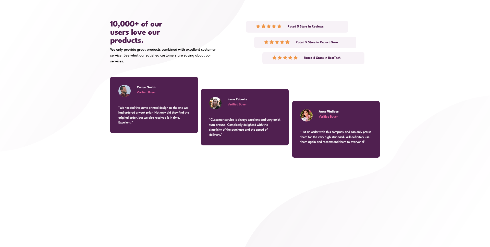

# Frontend Mentor - Social proof section solution

This is a solution to the [Social proof section challenge on Frontend Mentor](https://www.frontendmentor.io/challenges/social-proof-section-6e0qTv_bA). Frontend Mentor challenges help you improve your coding skills by building realistic projects.

## Table of contents

- [Overview](#overview)
  - [The challenge](#the-challenge)
  - [Screenshot](#screenshot)
  - [Links](#links)
- [My process](#my-process)
  - [Built with](#built-with)
  - [What I learned](#what-i-learned)
- [Author](#author)

## Overview

### The challenge

Users should be able to:

- View the optimal layout for the section depending on their device's screen size

### Screenshot

### Links

- Solution URL: [https://github.com/lawlawson/social-proof-section](https://github.com/lawlawson/social-proof-section)
- Live Site URL: [https://bejewelled-marigold-51491d.netlify.app/](https://bejewelled-marigold-51491d.netlify.app/)

## My process

### Built with

- Semantic HTML5 markup
- CSS custom properties
- Flexbox
- CSS Grid
- Mobile-first workflow

### What I learned

This project was a great opportunity to practice semantic HTML and really challenged code considerations around using flexbox and grid. It was also a good opportunity to learn about working with background images and usage across different screen/device sizes. Generally there were some interesting layout considerations which proved challenging at times.
## Author

- Website - [Lawrence](https://lawlawson.dev/)
- Frontend Mentor - [@lawlawson](https://www.frontendmentor.io/profile/lawlawson)
- Twitter - [@lawsoncodes](https://twitter.com/lawsoncodes)
